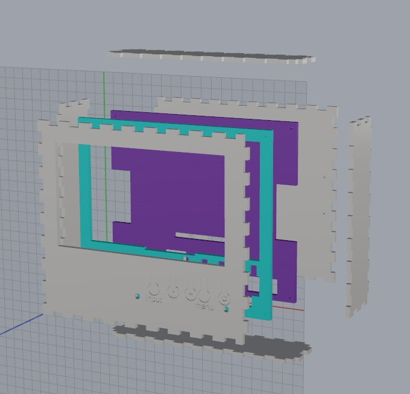
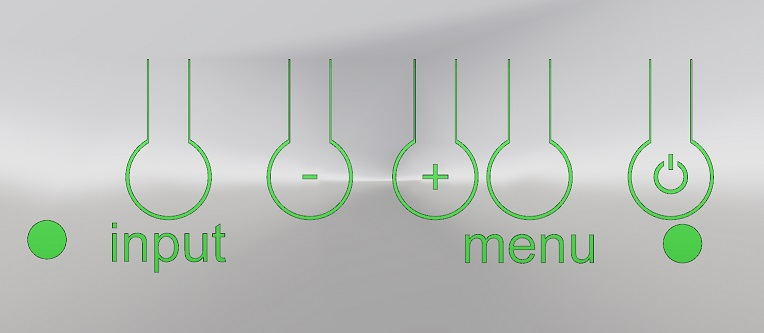

#Custom case for an el cheapo 7" ebay display
HL070TN92 PCB800066-V.9 e.g. http://www.ebay.de/itm/170835234421

Mostly a (diligent but) routine piece of work - measuring and consttructing
the case.

The mentionable thing: button inserts (4mm plywood) that you can actually press.

The notched box was done with BoxMaker: http://boxmaker.rahulbotics.com/
(code https://github.com/rahulbot/boxmaker)

... some more pics to come from the final box ...